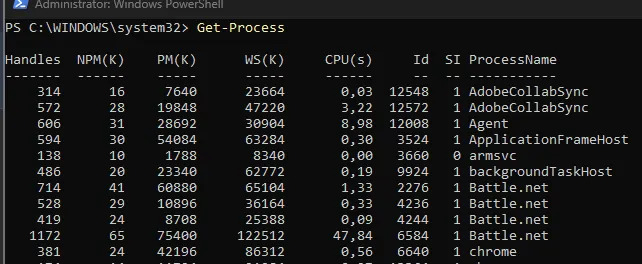
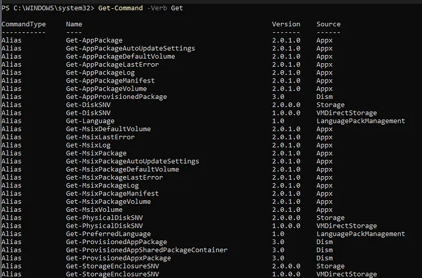
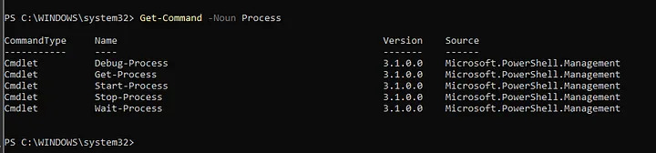
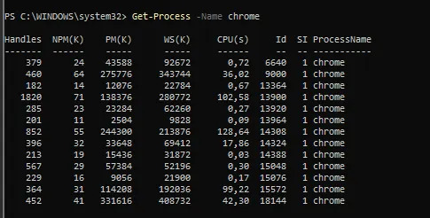
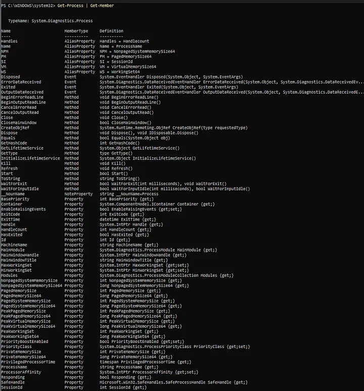

```PowerShell from Zero
Part 1 ✅ Understanding PowerShell
Part 2 ⏳ The Pipeline ← You are here
Part 3 ⏳ Filtering Objects
Part 4 ⏳ Variables
Part 5 ⏳ Parameters
Part 6 ⏳ Objects & Properties
Part 7 ⏳ Scripting Basics
Part 8 ⏳ Windows Administration
Part 9 ⏳ PowerShell for Security
Part 10 ⏳ Automation Project
```
If you are working with Windows and want to move beyond clicking through menus, sooner or later you will encounter PowerShell.
At first, PowerShell can look intimidating.
There are commands like:
```
Get-Process
Get-Service
Get-NetAdapter
Get-ChildItem
```

Then you start seeing things like:

```
-Name
-ComputerName
-ErrorAction

And eventually:

Where-Object
Select-Object
Sort-Object
```

At this point, it is very easy to think:

**“Do I really have to memorize all of this?”** No.

The goal of this series is not to memorize hundreds of commands. The goal is to understand how PowerShell works. Once you understand the underlying concepts, learning new commands becomes much easier.

##What is PowerShell?
PowerShell is Microsoft’s command-line shell and scripting environment for Windows administration and automation.

##You can use it to:
-manage processes
-work with files and directories
-manage services
-inspect network configuration
-manage users
-query system information
-automate repetitive tasks
-perform security and troubleshooting tasks

For example, instead of opening Task Manager to see running processes, you can simply run:
```
Get-Process
```
You can inspect Windows services with:
```
Get-Service
```
And network adapters with:
```
Get-NetAdapter
```
Already, we can see a pattern.

Many PowerShell commands are designed to be readable:
```
Get + Something
```
For example:
```
Get-Process
Get-Service
Get-ComputerInfo
Get-NetAdapter
```
This naming convention is one of the first things that makes PowerShell easier to understand.

##PowerShell vs CMD
If you have used Windows for a while, you have probably used Command Prompt.

For example:
```
ipconfig
```
or:
```
tasklist
```
CMD is still useful, but PowerShell was designed with much more powerful automation and object manipulation in mind. One of the biggest differences is what happens to the output.

Consider:
```
Get-Process
```
You see a table containing information about processes.
It might look like this:


It may look like PowerShell simply printed some text. But that is not really what is happening. PowerShell is working with objects. This is one of the most important concepts in the entire language.

##PowerShell Works With Objects
Let’s take:
```
Get-Process
```
The result is not just a block of text. Each process is represented as an object with properties and methods. For example, a process can have properties such as:
```
Name
Id
CPU
Path
Handles
```
This means we can interact with those properties directly.
For example:
```
Get-Process | Select-Object Name, Id, CPU
```
Now we are telling PowerShell: Get the processes, but show me only their Name, Id and CPU.

This is very different from manually parsing text. And this concept becomes extremely important when we start working with the pipeline in Part 2.

Cmdlets: The Building Blocks of PowerShell
PowerShell commands are often called cmdlets.
A cmdlet usually follows a:
```
Verb-Noun
```
structure.

For example:
```
Get-Process
Get-Service
Get-Location
Set-Location
Stop-Process
Start-Service
```
This naming system makes commands easier to discover.

For example, if you want to retrieve information about services, you can probably guess:
```
Get-Service
```
If you want to stop a process:
```
Stop-Process
```
If you want to retrieve information:
```
Get-...
```
If you want to modify something:
```
Set-...
```
If you want to remove something:
```
Remove-...
```
If you want to start something:
```
Start-...
```
You don’t need to memorize every command immediately.
You can discover them. And this brings us to one of the most useful PowerShell commands.

###Get-Command — Discover Commands
Suppose you want to find commands related to processes.
Instead of searching Google, you can ask PowerShell:
```
Get-Command *Process*
```
You may see commands such as:

Press enter or click to view image in full size

You can also search by verb:
```
Get-Command -Verb Get
```


Or by noun:

```
Get-Command -Noun Process
```

This is a very important habit. Instead of thinking:**“I don’t know the command.”**
Think: **“How can I make PowerShell show me the command?”**

##Learning Command Parameters with Get-Help
As you continue learning PowerShell, you’ll notice that most cmdlets can do much more than their default behavior. This is possible because they support parameters.

For example, running:
```
Get-Process
```
returns all running processes on your system. However, what if you’re only interested in Google Chrome? Instead of retrieving every process, you can narrow the output by using the -Name parameter:
```
Get-Process -Name chrome
```

Here, -Name tells PowerShell to return only the processes whose name matches chrome.

At first, seeing parameters like -Name, -Id, -ComputerName, or -ErrorAction can feel overwhelming. It might seem like you need to memorize every available option for every cmdlet.

Fortunately, that’s not how PowerShell is meant to be learned.

Whenever you want to know what a cmdlet is capable of, simply ask PowerShell itself:
```
Get-Help Get-Process -Full
```
The help page provides detailed information about the cmdlet, including:

A description of what the cmdlet does.
All available parameters.
Parameter descriptions.
Usage examples.
Additional notes and related commands.
For example, you’ll discover that Get-Process supports parameters such as:

Get-Process -Name chrome
Get-Process -Id 4321
Instead of memorizing syntax, develop the habit of exploring a cmdlet through its built-in documentation.

This approach is far more valuable because every PowerShell cmdlet follows the same idea: if you know how to use Get-Help, you can learn any cmdlet on your own.

Get-Member — What Can This Object Do?
Now we are getting to something really important. Remember that PowerShell works with objects. But how do we know what properties an object has?

Become a Medium member
Meet:

Get-Member
For example:

Get-Process | Get-Member


This shows us the members of the objects returned by Get-Process. You will see things such as properties and methods.
For example:

Name
Id
CPU
Path
Kill()
WaitForExit()
You can think about it like this: Properties describe an object.

Name
Id
CPU
Path
Methods perform actions.

Kill()
WaitForExit()
We will explore properties and methods in much more detail later in the series.

For now, just remember:

Get-Member
is a way of asking:

“What exactly am I working with?”

A Small Investigation
Let’s put these ideas together.

Start with:

Get-Process
Then ask:

Get-Process | Get-Member
Now we know what kind of object we are dealing with.

Then:

Get-Process | Select-Object Name, Id, CPU
Press enter or click to view image in full size

Now we are selecting specific properties. We haven’t even learned the pipeline properly yet, but we have already started using it.

And this is where PowerShell starts becoming interesting.

A Different Way of Thinking
When learning PowerShell, try not to think like this: “What command do I need to memorize?” Instead, think like this: “What information do I want?”

For example:

I want to see running processes.

Get-Process
I want to know what properties those processes have.

Get-Process | Get-Member
I only want the process name and PID.

Get-Process | Select-Object Name, Id
This way of thinking will become extremely powerful later.

What We Learned
In this first part, we learned the basic mental model of PowerShell:

1. PowerShell is more than a command prompt
It can be used for system administration, troubleshooting and automation.

2. Commands usually follow Verb-Noun
Get-Process
Get-Service
Stop-Process
Start-Service
3. PowerShell works with objects
The output of a command is not simply text that we have to manually parse.

4. Get-Command helps us discover commands
Get-Command *Process*
5. Get-Help gives us documentation
Get-Help Get-Process
6. Get-Member lets us inspect objects
Get-Process | Get-Member
These three commands alone are worth remembering:

Get-Command
Get-Help
Get-Member
They are essentially our first PowerShell toolkit.

Practice Tasks
Congratulations! You’ve completed Part 1.

Now it’s time to practice what you’ve learned. Try to solve the following tasks without searching for the answers immediately. Use the commands introduced in this article and explore PowerShell’s built-in help system whenever you get stuck.

Task 1 — Explore Running Processes
Display all running processes on your system.

Task 2 — Discover Process Commands
Find every PowerShell command related to processes.

Task 3 — Learn About Get-Service
Without opening a web browser, find the documentation for the Get-Service cmdlet.

Then answer these questions:

What does it do?
Which parameters does it support?
Can you find an example in the documentation?
Task 4 — Show Only What You Need
Display only the following properties for running processes:

Process Name
Process ID
Task 5 — Inspect an Object
Use PowerShell to discover:

What properties does a process object have?
Can you find any methods?
Try to identify at least five properties and two methods.

Task 6 — Investigate a New Cmdlet
Choose a cmdlet you haven’t used before.

For example:

Get-Location
Get-Date
Get-ComputerInfo
Without searching online:

Discover what it does.
Read its help page.
Find one useful example.
Task 7 — Find Parameters
Investigate the Get-Process cmdlet.
Can you find a parameter that allows you to retrieve a process by:

Name
ID
How did you discover those parameters?

Task 8 — Compare the Output
Run the following commands:

Get-Process & Get-Process | Select-Object Name, Id
Compare the outputs.

Ask yourself:

Which one contains more information?
Which one is easier to read?
Why might selecting only the necessary properties be useful?
Task 9 — Challenge Yourself
Without using Google, try to answer this question: “How can I find every cmdlet related to networking?”
Use only the tools you’ve learned in this chapter.

What’s Next?
In the next part, we will look at one of the most important concepts in PowerShell:

The Pipeline |
We’ll start with something simple:

Get-Process
and gradually transform it into:

Get-Process |
Where-Object CPU -gt 100 |
Sort-Object CPU -Descending |
Select-Object -First 10 Name, Id, CPU
Instead of simply running commands, we’ll learn how to take the output of one command, send it to another command, filter it, sort it and select exactly the information we need.

That’s where PowerShell starts to become really powerful.

PowerShell from Zero — Part 2: Understanding the Pipeline coming next.
